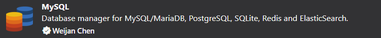

# Projeto de Charadas usando NodeJS 🤓
<h3>
  APRESENTAÇÃO
</h3>
<p>
  Seja bem-vindo ao nosso incrível site de charadas! Aqui, você encontrará um pequeno universo de diversão e aprendizado, repleto de enigmas inteligentes e divertidos.
  
  Nossa página de charadas tem como objetivo introduzir você ao incrível mundo do desenvolvimento web e mostrar como a linguagem Node.js pode ser empregada de maneira prática e divertida.
  Prepare-se para mergulhar em um mundo de enigmas intrigantes e desafios estimulantes. Explore, divirta-se e, acima de tudo, aprenda enquanto desvenda os mistérios das nossas charadas!
</p>

<h3>
  POR QUE CHARADAS E NODEJS JUNTOS?
</h3>
<p>
  A resposta é simples: ambos exigem pensamento lógico e criatividade. Assim como resolver uma charada requer uma abordagem estruturada e a 
  capacidade de pensar fora da caixa, o desenvolvimento em Node.js também exige habilidades semelhantes. Com este site, queremos mostrar como o aprendizado pode ser envolvente e divertido.
  
  Ao explorar nossas charadas, você não apenas desafiará sua mente, mas também aprenderá conceitos fundamentais de Node.js enquanto se diverte. Quer você seja um iniciante curioso ou um 
  desenvolvedor experiente em busca de uma maneira diferente de praticar suas habilidades, nossa página de charadas oferece algo para todos.
  
  <br>
  
 **💡: Alguns arquivos terão comentários explicativos sobre uma linha ou um bloco, para ser fácil a compreensão do código.**

**⚠️: Caso haja alguma alteração o README será atualizado.**
</p>

<hr>

<h3>
  EDITOR DE CÓDIGO 💻
</h3>

<p>
  Visual Studio Code
  <a href="https://code.visualstudio.com/">
    Acesse nesse link
  </a>
</p>

<hr>
  
<h3>
  BIBLIOTECAS E FRAMEWORKS🗃️
</h3>

<ul>
  <li>
    <a href="https://www.npmjs.com/package/body-parser">
       body-parser
    </a>
  </li>
  
  <li>
    <a href="https://ejs.co/">
       ejs
    </a>
  </li>
  
  <li>
    <a href="https://expressjs.com/">
       express
    </a>
  </li>
  
  <li>
    <a href="https://www.npmjs.com/package/mysql2">
       mysql2
    </a>
  </li>
  
  <li>
    <a href="https://www.npmjs.com/package/nodemon">
       nodemon
    </a>
  </li>
  
  <li>
    <a href="https://sequelize.org/">
       sequelize
    </a>
  </li>

  <li>
    <a href="https://getbootstrap.com/">
       bootstrap 5
    </a>
  </li>
</ul>

<p>
  Para baixar todas elas use:

  ```
  npm install
  ```

</p>

<hr>

<h3>
  START O PROJETO
</h3>

<p>
  
  **Menos recomendado para este projeto**
  
  ```
  node index.js
  ```

  <ul>
    <li>Vantagens: comando existente no próprio node.</li>
    <li>Desvantagens: ao mudar algo no código precisa reiniciar novamente.</li>
  </ul>

  **Recomendado para este projeto**

  ```
  nodemon index.js
  ```

  <ul>
    <li>Vantagens: atualiza automaticamente sem precisar reiniciar o terminal.</li>
    <li>Desvantagens: precisa instalar a biblioteca.</li>    
  </ul>

  **Mais recomendado para este projeto**

  ```
  node --watch index.js
  ```

  <ul>
    <li>Vantagens: comando existente no próprio node e atualiza automaticamente sem precisar reiniciar o terminal.</li>
  </ul>
  
</p>

<hr>

<h3>
  BANCO DE DADOS
</h3>

<p>
  Nas Extensões do VSCode pesquise por MySQL, instale e configure seu banco de dados local.
  <br>
  <br>
  <a href="https://github.com/anacecilia-hb/charadas-node">
    
  </a>

  Para fazer conexão com o seu banco apenas troque as informações em:
  
  > 📁 charadas-node/database/database.js
  
  Mais informações estarão no seguinte caminho de pastas:
  
  > 📁 charadas-node/database/charadas.sql

  <br>
  
  **💡: Não esqueça de fazer as possíveis alterações, referente ao banco, nos outros arquivos.**
  
</p>
